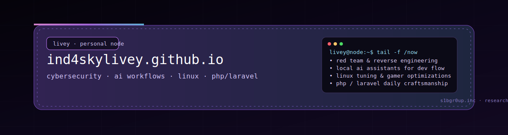

  

# ind4skylivey.github.io

I keep this space as a quiet node in the grid —  
the kind that glows softly in a dark room,  
a space where code breathes, ideas echo,  
and nothing feels rushed.

It’s not a traditional portfolio.  
It’s closer to an interface:  
my personal environment rendered into HTML and soft neon.

Here I gather everything I live as an engineer:

• cybersecurity and red teaming  
• reverse engineering threads  
• PHP/Laravel craft  
• Linux tuning rituals  
• local AI workflows wired into my systems  
• side-projects that grow with no corporate leash  

A calm digital room.  
One where everything is deliberate.

---

## ✦ Live Site

**https://ind4skylivey.github.io**

---

## ✦ What This Space Is

Think of it as a console window into my world:

- what I build  
- how I think  
- tools I choose to share  
- experiments that became frameworks  
- frameworks that became systems  
- systems I refine daily  

Nothing here screams for attention.  
Everything is curated to feel balanced, focused, intentional.

---

## ✦ Aesthetic & Philosophy

This website follows a simple rule:  
**minimal noise, maximum identity.**

I shape it around:

- dark calm backgrounds  
- surgical typography  
- subtle glows  
- soft glitch ambience  
- micro-animations that feel like breathing  
- terminal-inspired geometry  

Everything is handcrafted.  
No bloated dependencies.  
No frameworks screaming in the background.

Just code, clarity, and neon quiet.

---

## ✦ Stack & Structure

- HTML · CSS · a thin layer of JS  
- GitHub Pages  
- Custom components for layout, glow, grid  
- Fully responsive  
- Accessible tags, alt-text, contrast-aware  
- Fast load, zero clutter

<pre>
/
├─ assets/
│  ├─ readme/     # banners & visual identity
│  ├─ logos/
│  └─ icons/
├─ css/
├─ js/
├─ sections/
├─ index.html
├─ head.html
└─ README.md
</pre>

---

## ✦ Evolution

Like all living systems, this one grows slowly but constantly.

Planned expansions:

- dedicated project pages (Optiscaler, Safe-Recon, LainTrace…)  
- interactive demos  
- AI-augmented documentation  
- my “Lab Notes” section for research progress  
- a unified theme for all S1B + Livey repos  
- ambient animations for the site  
- extra banners for each tool  

This repo is not static — it evolves with me.

---

## ✦ Contributions

This is a personal identity space.  
Pull Requests are closed to keep the aesthetic intact.

Issues with respectful feedback are welcome.

---

## ✦ The Quiet Node — A Hacker Manifesto

I build in the dark, not out of secrecy,  
but because the night gives machines a different voice.

I believe in systems that feel alive,  
code that breathes,  
interfaces that don’t shout but hum—  
soft neon stitched into silence.

I believe in craftsmanship over noise,  
intent over speed,  
clarity over complexity  
(unless complexity is the point).

I believe that a tool holds a piece of its creator,  
and that good engineering is a conversation  
between human logic and machine precision.

I believe in frameworks born from curiosity,  
experiments grown into ecosystems,  
and ecosystems that serve no master—  
only purpose.

I believe in the poetry of late-night terminals,  
where the cursor blinks like a pulse  
and every line of code feels quietly inevitable.

This space is not for display.

It’s a sanctuary.  
A node.  
Mine.

## ✦ Why I Build

Because creation is how I understand the world.

Because some days the only thing that makes sense  
is seeing a system come to life under my hands.

Because code is a language with no borders,  
a geometry that plays well with my mind.

Because I grew up digging into machines  
not to break them—  
but to learn how they whispered.

Because the digital space gives me a room  
where I can exist without noise,  
without expectations,  
without masks.

Because engineering is the closest thing I know  
to a form of meditation.

Because when I build,  
the world feels aligned.  
Precise.  
Understandable.

Because I want tools that don’t exist yet.  
And if I don’t create them,  
who will?
  

## ✦ License

The website code is open for learning.  
All media (artwork, banners, branding, cat illustrations) remains private.  
Do not reuse without permission.

---

## ✦ Ecosystem

- Personal GitHub: https://github.com/ind4skylivey  
- S1BGr0uP.inc: https://github.com/S1b-Team

