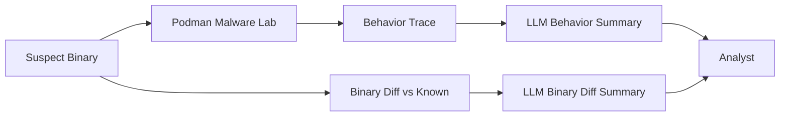

# AI-Augmented Binary Diffing
## Using LLMs to Prioritize Suspicious Functions in Modified Binaries

---

> **PROJECT STATUS:** `ACTIVE` 🟢
> **STACK:** Ghidra/Radare2 · **AI:** Local LLMs (Llama/Mistral)
> **FOCUS:** Binary Diffing · Semantic Analysis · Reverse Engineering
>  

### ⚡ TL;DR

Binary analysis often hinges on a simple yet brutal question:
"What changed between this clean version and this compromised version?"

With source code, `git diff` is trivial. With binaries, it's a different universe: compilers, optimizations, inlining, symbol stripping, offset shifts, and reordered structures.

This research proposes a **hybrid approach**:
*   **Classic Binary Diffing:** (RE tools, call graphs, function hashes).
*   **Large Language Models (LLMs):** As a layer for *interpretation*, prioritization, and semantic summary.

The goal is not to replace the analyst or RE tools, but to **convert a massive list of "Function A changed" into a commented map of "these functions probably matter most."**

---

## 1. Objective

Design and document a reproducible pipeline to:

1.  **Compare two binaries:**
    *   `sample_clean.bin` (Reference version).
    *   `sample_suspect.bin` (Modified or potentially compromised version).
2.  **Extract differences** at the function, section, and call-graph level.
3.  **Feed these differences** into a Large Language Model (LLM) with technical context.
4.  **Obtain output:**
    *   Change summaries.
    *   Suspicious function rankings.
    *   Hypotheses on malicious behavior.
    *   Guides on which parts of the binary to analyze first in depth.

This approach targets environments for:
*   Malware analysis.
*   Third-party binary auditing.
*   Software supply chain integrity verification.
*   Incident response where only binaries are available, not source code.

---

## 2. Technical Context: Why Binary Diffing Hurts

Unlike source code, binaries:
*   Lack comments.
*   May be stripped of symbols.
*   Have offsets dependent on the linker/compiler.
*   Undergo aggressive optimizations (inlining, unrolling, etc.).

Traditional diffing tools (e.g., based on function graphs, structural hashes, heuristics) are excellent but produce **massive output**, and it's not always obvious which changes are functionally relevant.

**Enter the LLM:** Not to discover differences (tools already do that well), but to **transform noisy output into a prioritized summary.**

---

## 3. General Pipeline Architecture

### 3.1 High-Level View

```mermaid
flowchart LR
    A[Clean Binary<br/>sample_clean.bin] --> P[Preprocessing]
    B[Suspect Binary<br/>sample_suspect.bin] --> P

    P --> D[Binary Diff Engine<br/>(functions, CFG, hashes)]
    D -->|JSON / CSV changes| F[Feature Extractor]

    F --> L[LLM Analyzer<br/>(summaries + ranking)]
    L --> R[Final Report<br/>"Suspicious Functions"]
```

### 3.2 Components

*   **Binary Diff Engine:** Classic RE layer (compares functions, sections, references).
*   **Feature Extractor:** Normalizes the diff into a readable format (JSON, CSV, structured text).
*   **LLM Analyzer:** Processes data with carefully designed prompts to summarize, prioritize, and generate hypotheses.

---

## 4. Suggested Tooling

*(Not mandatory, but these fit the approach well)*

*   **Disassembly / Static Analysis:** `radare2` / `rizin`, `Ghidra`.
*   **Structural Diffing:** Scripts that extract function lists, code hashes, API calls, string references.
*   **Glue / Orchestration:** Python for executing tools, parsing outputs, generating intermediate JSON, calling LLM via API/CLI.
*   **LLM:** A generative model you understand and control (local or remote), with prompts adapted to technical language (RE, malware, binaries).

---

## 5. Step 1: Extract Functions & Metadata

Example conceptual workflow with `radare2` (from a container or host):

```bash
r2 -A sample_clean.bin -qc 'aflj' > clean_functions.json
r2 -A sample_suspect.bin -qc 'aflj' > suspect_functions.json
```

`aflj` returns a JSON list of functions with: name, address, size, type, etc.

Complement with strings:
```bash
r2 -A sample_clean.bin -qc 'izj' > clean_strings.json
r2 -A sample_suspect.bin -qc 'izj' > suspect_strings.json
```

---

## 6. Step 2: Function Matching & Diffing

A Python script can:
1.  Load `clean_functions.json` and `suspect_functions.json`.
2.  Attempt to match functions by name (if symbols exist) or heuristics (relative address, size, byte patterns).
3.  Classify functions into:
    *   **New** (In suspect, not clean).
    *   **Removed** (In clean, not suspect).
    *   **Modified** (Different hash/body).
    *   **Unchanged**.

**Conceptual Diff Structure:**

```json
{
  "new_functions": [
    {
      "name": "sub_401000",
      "size": 120,
      "calls": ["InternetOpenA", "CreateFileA"],
      "strings": ["C2_CONNECT", "Global\Mutex_ABC"]
    }
  ],
  "modified_functions": [
    {
      "name": "sub_402000",
      "size_before": 80,
      "size_after": 132,
      "delta_size": 52,
      "new_calls": ["VirtualAlloc", "VirtualProtect"],
      "removed_calls": [],
      "new_strings": ["payload_start"],
      "removed_strings": []
    }
  ],
  "removed_functions": [
    { "name": "sub_403000", "size_before": 64 }
  ]
}
```
This JSON is gold for the LLM.

---

## 7. Step 3: Feature Engineering for the LLM

Before feeding the model, "cook" some features:

**Suspicion Score (Script-calculated):**
Points if:
*   Calls sensitive APIs (networking, crypto, process, memory).
*   Uses strange names.
*   Appears near high-entropy sections.
*   Was added or grew significantly.

**Global Context:**
*   Total new functions.
*   Percentage of binary modified.
*   Average entropy per new section.

**Intermediate Table Example:**

| Function | Type | Δ Size | New APIs | New Strings | Prelim Score |
| :--- | :--- | :--- | :--- | :--- | :--- |
| `sub_401000` | NEW | 120 | `InternetOpenA`, `CreateFileA` | `C2_CONNECT`, `Mutex_ABC` | 0.92 |
| `sub_402000` | MODIFIED | 52 | `VirtualAlloc`, `VirtualProtect` | `payload_start` | 0.88 |
| `sub_403000` | REMOVED | -64 | - | - | 0.10 |

---

## 8. Step 4: Prompt Design

**Example Prompt:**

> **Context:** I am analyzing two binaries: one clean and one suspect. I have performed a binary diff. Below you will see:
> *   A list of NEW functions in the suspect binary.
> *   A list of MODIFIED functions.
> *   A list of REMOVED functions.
> *   Metadata per function (APIs, strings, size changes).
>
> **Your Task:**
> 1.  Identify which functions are most suspicious and why.
> 2.  Explain, in technical language, what type of malicious behavior each suspicious function might be implementing.
> 3.  Propose a priority order for a human analyst to manually review in Ghidra or radare2.
> 4.  Point out patterns of interest: C2, injection, escalation, persistence, etc.
>
> **Output Format:**
> *   Ordered list of suspicious functions (Critical to Low).
> *   Technical comments per function.
> *   Behavioral hypotheses (not absolute statements).
> *   Recommended questions for the next RE phase.

*(Then pass the JSON or tabulated summary)*

---

## 9. Expected LLM Output (Simplified)

```markdown
### Suspicious Function Ranking

1. `sub_401000` (NEW)
   - **Reasons:** Calls `InternetOpenA` and `CreateFileA`. Strings: `"C2_CONNECT"`, `"Global\Mutex_ABC"`.
   - **Hypothesis:** Likely implements initial C2 beaconing routine. The mutex prevents multiple simultaneous executions.
   - **Action:** Check cross-references to this function.

2. `sub_402000` (MODIFIED)
   - **Reasons:** Size increase (+52 bytes). New calls to `VirtualAlloc` and `VirtualProtect`. String `"payload_start"`.
   - **Hypothesis:** Probable payload loader or second-stage decryptor. Could be injecting code into memory.
   - **Action:** Analyze memory protection changes.

3. `sub_403000` (REMOVED)
   - **Reasons:** Removed function previously used for logging/debug.
   - **Hypothesis:** Removal of benign logic to hide behavior or reduce footprint. Low priority.
```
This output doesn't do magic, but it gives you an **attack order** for your manual RE.

---

## 10. Reproducible Pipeline (Operational Summary)

1.  **Obtain** clean and suspect binaries.
2.  **Extract** functions, strings, sections (`radare2` / `Ghidra`).
3.  **Match** functions and generate structural diff (Python).
4.  **Calculate** features and preliminary score.
5.  **Generate** structured JSON/Markdown.
6.  **Feed** diff + context to LLM with specific prompts.
7.  **Receive:** Ranking, hypotheses, priority map.
8.  **Analyze** top-N functions manually.
9.  **Report** findings.

---

## 11. Limitations & Risks

*   **Not a Truth Oracle:** The LLM suggests hypotheses, not absolute truths. Verification is mandatory.
*   **Context Dependence:** Bad prompts or noisy input lead to hallucinations.
*   **Privacy:** Never send sensitive binaries to external APIs. Use local models or sanitized features.
*   **Aggressive Compilers:** Small source changes can cause massive binary changes. The pipeline must account for semantic vs. machine-level differences.

---

## 12. Ecosystem Integration (Livey-verse Bonus)

This technique fits perfectly with:

*   **Containerized Malware Baselines:** Generate diffs between different samples of the same family.
*   **Multi-Network Cyberdecks:** Combine binary differences with observed C2 behavior differences.
*   **Rootless Escape Resilience:** Check if new functions add dangerous system calls for escape or escalation.

**Global Pipeline Concept:**



The analyst receives:
*   Dynamic behavior summary.
*   Structural binary change summary.
*   Map of functions to review.

---

## 13. Future Work

*   **Public "Binary-Diffs + Interpretations" Dataset:** To compare how different models reason about the same changes.
*   **Sophisticated Automated Ranking:** Train a classic model (non-LLM) to score suspicious functions based on features.
*   **Integration:** Connect with **AetherFrame** and **Reveris Noctis**.
*   **CI/CD for Binaries:** Apply this in supply-chain scenarios: New vendor binary version → Automatic Diff + Summary.

---

## 14. Conclusion

**AI-Augmented Binary Diffing** isn't about "AI doing reverse engineering for you." It's about something more tactical and realistic:

**Reducing a mountain of binary differences to a short list of functions that deserve immediate attention.**

The analyst remains in command. The LLM is a co-pilot that organizes chaos, highlights critical APIs, proposes hypotheses, and hands you an attack map for your next Ghidra/radare2 session.

That's not magic: it's model-assisted engineering, built for people who live among hexdumps, call graphs, and rootless containers.