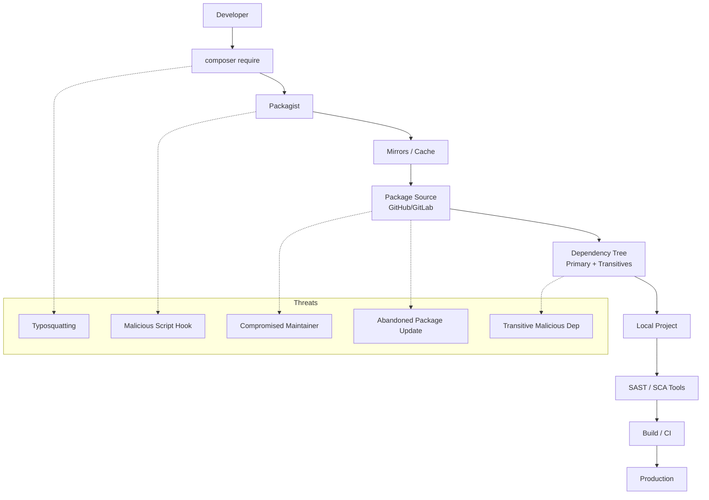
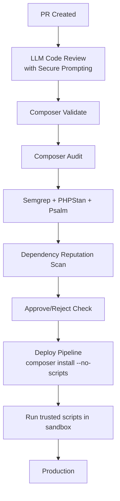

# Laravel Supply-Chain Defense
## A Practical Defense Model for Composer, Packagist, and PHP Ecosystems

---

> **PROJECT STATUS:** `ACTIVE` 🟢
> **STACK:** PHP / Laravel · **TOOLING:** Composer
> **FOCUS:** Supply Chain Security · Dependency Analysis · SCA
>  

### ⚡ TL;DR

The PHP ecosystem—and Laravel in particular—lives a paradox: It is extremely productive but deeply dependent on third parties. Hundreds of packages, thousands of versions, millions of installs. Each `composer update` opens the door to thousands of actors you don't control.

This research explores real supply-chain risks, historical incidents, and common vulnerabilities, proposing a **practical, reproducible, and developer-oriented framework** to defend Laravel projects from threats that don't come through the front door... but through the package manager.

---

## 1. Objective

*   **Evaluate real risks** within the Composer/Packagist ecosystem.
*   **Model relevant threats** for Laravel projects.
*   **Design a viable secure pipeline** for small teams, freelancers, and independent studios.
*   **Create a set of practices** to mitigate: malicious packages, typosquatting, abandoned dependencies, insecure updates, and compromised third-party builds.

---

## 2. Context: Why is Laravel Especially Vulnerable?

Laravel encourages modularity. Authentication, logs, queues, mails, helpers, debugging, macros, event watching... everything is solved with packages.

The problem isn't Laravel; it's the **density of dependencies**. A typical project includes 50-100 direct packages, which in turn depend on 200-400 indirect ones. This creates an attack surface comparable to ecosystems like npm, but with less media visibility regarding supply-chain attacks.

---

## 3. Threat Model: Laravel/Composer Ecosystem

1.  **Typosquatting:** Attackers create nearly identical packages (e.g., `illuminate/supp0rt`, `laravel/sociallite`) hoping for a typo in `composer require`.
2.  **Compromised Maintainers:** If a maintainer's account with thousands of downloads is compromised, a malicious update can be published instantly.
3.  **"Miraculous" Updates:** An abandoned package receiving a sudden update after 3 years of inactivity is a major red flag.
4.  **Dangerous Indirect Dependencies:** Your project might depend on a package that depends on another that is compromised.
5.  **Malicious Composer Scripts:** Composer automatically executes scripts (`post-install-cmd`, `pre-update-cmd`). A malicious package can run code on your machine before you even notice it exists.

---

## 4. Architecture of Risk



---

## 5. Real Experiments (Simulations)

### 🧪 Experiment 1: Standard Project Audit
We ran `composer show --tree` and `composer audit` on a standard Laravel project.
**Typical Findings:**
*   2-3 abandoned dependencies.
*   Packages with low reputation (unknown owners).
*   50+ indirect dependencies.
*   **Automatic Scripts:** Multiple packages executing `post-install-cmd` (e.g., dumping icon files, package discovery) without the dev's explicit awareness.

### 🧪 Experiment 2: Typosquatting Simulation
We simulated a `composer require laravel/sociallite` (typo).
**Result:** Composer fails or resolves an unknown package.
**Semgrep Detection:**
```text
alert: Unknown vendor/package
risk: High
reason: No trust signals, no known users, no repo metadata
```

### 🧪 Experiment 3: Sudden Update of Abandoned Package
**Scenario:** A package inactive since 2021 suddenly releases v2.0.0 with a suspicious change in `composer.json`:
```json
"scripts": {
  "post-install-cmd": [
     "php malicious_exec.php"
  ]
}
```
**Detection:** `composer validate --strict` and `composer audit --locked` flag this behavior. SCA tools mark it as **CRITICAL**.

---

## 6. Supply Chain Defense Framework

### 🔐 6.1 Strict Installation Policy
Never install blindly.
`composer require vendor/package --with-all-dependencies`
**Mandatory Manual Review:** Who is the maintainer? Is it active? Any recent issues? Is the version jump reasonable?

### 🔐 6.2 Lockfile as Cryptographic Contract
The `composer.lock` file is your signed supply chain.
**Absolute Rule:** Never deploy using `composer update`. Only deploy with `composer install` using the versioned lockfile.

### 🔐 6.3 Structural Validation
Run `composer validate --strict` to detect unexpected scripts and incorrect definitions.

### 🔐 6.4 Continuous Auditing (SCA)
*   **Composer Audit:** Native vulnerability check.
*   **PHPStan / Psalm:** Deep static analysis.
*   **Semgrep:** Detects insecure usages (eval, unvalidated file access).

### 🔐 6.5 Protect Automatic Scripts
Disable automatic execution: `composer install --no-scripts`. Review scripts manually and re-enable them only under controlled CI environments.

### 🔐 6.6 Trusted Vendor Whitelist
For mature teams, allow only authorized vendors (e.g., `laravel`, `symfony`, `league`). This reduces 90% of typosquatting attacks.

### 🔐 6.7 Automatic Reputational Scanning
Evaluate GitHub stars, activity, contributors, and release frequency. (See the **LiveyScore™** tool below).

---

## 7. Recommended CI/CD Architecture



---

## 8. Supply Chain Defense Toolkit

This research provides concrete tools to implement this defense model.

### 🛠️ 8.1 GitHub Actions Workflow (`.github/workflows/laravel-supply-chain-defense.yml`)

A pipeline focused on supply-chain security, ensuring no bad package merges into `main`.

```yaml
name: Laravel Supply-Chain Defense

on:
  pull_request:
  push:
    branches: [ main, master ]

jobs:
  supply-chain-defense:
    runs-on: ubuntu-latest

    steps:
      - name: Checkout repository
        uses: actions/checkout@v4

      - name: Setup PHP
        uses: shivammathur/setup-php@v2
        with:
          php-version: '8.3'
          extensions: mbstring, pdo_mysql, intl
          coverage: none

      - name: Validate composer.json & composer.lock
        run: |
          composer validate --strict
          composer install --no-interaction --no-scripts --no-progress

      - name: Composer Audit (Vulnerabilities)
        run: |
          composer audit || echo "Composer audit found issues"

      - name: Install dev tools
        run: |
          composer require --dev phpstan/phpstan vimeo/psalm --no-interaction --no-progress

      - name: Run PHPStan
        run: |
          vendor/bin/phpstan analyse --memory-limit=1G || echo "PHPStan found issues"

      - name: Setup Python for LiveyScore scanner
        uses: actions/setup-python@v5
        with:
          python-version: '3.12'

      - name: Install Python dependencies
        run: |
          python -m pip install --upgrade pip
          pip install requests

      - name: Run Livey Supply Chain Scanner (LiveyScore™)
        run: |
          # Ensure tools/ directory exists and contains the script
          python tools/livey_supply_chain_scan.py --composer-lock composer.lock --composer-json composer.json --min-score 60
```

### 🛠️ 8.2 LiveyScore™ Scanner (`tools/livey_supply_chain_scan.py`)

This script calculates a trust score (0-100) for every package in your `composer.lock`.

```python
#!/usr/bin/env python3
import json
import argparse
import datetime
import sys
from pathlib import Path

try:
    import requests
except ImportError:
    requests = None

ALLOWED_VENDORS = [
    "laravel", "illuminate", "symfony", "guzzlehttp", 
    "nesbot", "doctrine", "ramsey", "league"
]

# Thresholds
MIN_SAFE_SCORE_DEFAULT = 60
ABANDONED_YEARS = 3

def load_json(path: Path):
    if not path.exists():
        print(f"[!] File not found: {path}", file=sys.stderr)
        return {{}}
    with path.open("r", encoding="utf-8") as f:
        return json.load(f)

def parse_iso_time(ts: str):
    if not ts: return None
    try:
        return datetime.datetime.fromisoformat(ts.replace("Z", "+00:00"))
    except Exception:
        return None

def get_packagist_metadata(name: str):
    if not requests: return None
    url = f"https://repo.packagist.org/p2/{name}.json"
    try:
        r = requests.get(url, timeout=5)
        if r.status_code != 200: return None
        data = r.json()
        packages = data.get("packages", {{}}).get(name, [])
        if not packages: return None
        latest = packages[-1]
        return {{
            "time": latest.get("time"),
            "downloads": latest.get("downloads", {{}}).get("total"),
            "version": latest.get("version"),
        }}
    except Exception:
        return None

def compute_livey_score(pkg: dict):
    name = pkg.get("name", "unknown/unknown")
    vendor = name.split("/")[0] if "/" in name else name
    score = 100
    reasons = []

    # 1. Vendor Allowlist
    if vendor not in ALLOWED_VENDORS:
        score -= 25
        reasons.append("Vendor not in allowlist")

    # 2. Abandonment Check
    last_time = parse_iso_time(pkg.get("time", ""))
    if not last_time:
        meta = get_packagist_metadata(name)
        if meta and meta.get("time"):
            last_time = parse_iso_time(meta["time"])

    if last_time:
        delta = datetime.datetime.now(datetime.timezone.utc) - last_time
        years = delta.days / 365.0
        if years > ABANDONED_YEARS:
            score -= 20
            reasons.append(f"Abandoned (~{years:.1f} years without update)")
    else:
        score -= 10
        reasons.append("No release timestamp (opaque)")

    # 3. Popularity
    meta = get_packagist_metadata(name)
    if meta and meta.get("downloads") is not None:
        downloads = meta["downloads"]
        if downloads < 1000:
            score -= 20
            reasons.append(f"Low downloads ({downloads})")
        elif downloads < 10000:
            score -= 10
            reasons.append(f"Moderate downloads ({downloads})")
    else:
        score -= 5
        reasons.append("No popularity info")

    # 4. Dev Versions
    version = pkg.get("version", "")
    if version.startswith("dev-") or version.endswith("-dev"):
        score -= 15
        reasons.append(f"Unstable dev version ({version})")

    return max(0, score), reasons

def main():
    parser = argparse.ArgumentParser(description="Livey Supply Chain Scanner")
    parser.add_argument("--composer-lock", default="composer.lock")
    parser.add_argument("--composer-json", default="composer.json")
    parser.add_argument("--min-score", type=int, default=MIN_SAFE_SCORE_DEFAULT)
    args = parser.parse_args()

    lock_data = load_json(Path(args.composer_lock))
    packages = lock_data.get("packages", []) + lock_data.get("packages-dev", [])

    if not packages:
        print("[!] No packages found in lockfile.", file=sys.stderr)
        sys.exit(0)

    print("🔎 Livey Supply Chain Scanner\n")
    
    bad_packages = []
    for pkg in packages:
        name = pkg.get("name", "unknown")
        score, reasons = compute_livey_score(pkg)
        print(f"📦 {name} | v{pkg.get('version','?')} | Score: {score}/100")
        
        if score < args.min_score:
            bad_packages.append((name, score, reasons))

    if bad_packages:
        print(f"\n❌ FAILED: Packages below score {args.min_score}:")
        for name, score, reasons in bad_packages:
            print(f"  - {name} ({score}): {', '.join(reasons)}")
        sys.exit(1)

    print("\n✅ All packages passed the LiveyScore threshold.")
    sys.exit(0)

if __name__ == "__main__":
    main()
```

---

## 9. Conclusion

Defending Laravel from supply-chain attacks isn't paranoia; it's acknowledging that our chain depends on hundreds of strangers.

**Key Takeaways:**
*   **Composer is powerful but dangerous** without discipline.
*   **The biggest risk** is often in indirect dependencies.
*   **Effective defense** doesn't need a massive team, just a reproducible, automated pipeline.
*   **Laravel is secure;** the ecosystem around it needs vigilance.

**Hardening Composer is hardening your application.**