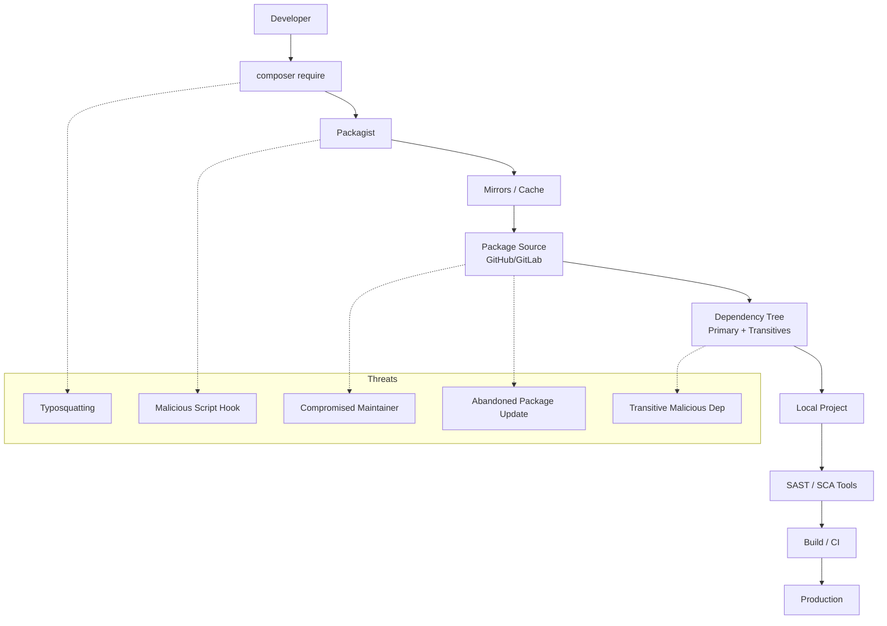

# Laravel Supply-Chain Defense
## A Practical Defense Model for Composer, Packagist, and PHP Ecosystems

---

> **PROJECT STATUS:** `ACTIVE` 🟢
> **STACK:** PHP / Laravel · **TOOLING:** Composer
> **FOCUS:** Supply Chain Security · Dependency Analysis · SCA
>  

### ⚡ TL;DR

The PHP ecosystem—and Laravel in particular—lives a paradox: It is extremely productive but deeply dependent on third parties. Hundreds of packages, thousands of versions, millions of installs. Each `composer update` opens the door to thousands of actors you don't control.

This research explores real supply-chain risks, historical incidents, and common vulnerabilities, proposing a **practical, reproducible, and developer-oriented framework** to defend Laravel projects from threats that don't come through the front door... but through the package manager.

This research delivers a **production-ready Supply Chain Toolkit**:
*   **LiveyScore™ 2.0:** An advanced scoring engine for dependencies.
*   **Configurable Policies:** YAML-based allow/deny lists.
*   **Automated CI/CD:** GitHub Actions integration.

---

## 1. Objective

*   **Evaluate real risks** within the Composer/Packagist ecosystem.
*   **Model relevant threats** for Laravel projects.
*   **Design a viable secure pipeline** for small teams, freelancers, and independent studios.
*   **Create a set of practices** to mitigate: malicious packages, typosquatting, abandoned dependencies, insecure updates, and compromised third-party builds.

---

## 2. Context: Why is Laravel Especially Vulnerable?

Laravel encourages modularity. Authentication, logs, queues, mails, helpers, debugging, macros, event watching... everything is solved with packages.

The problem isn't Laravel; it's the **density of dependencies**. A typical project includes 50-100 direct packages, which in turn depend on 200-400 indirect ones. This creates an attack surface comparable to ecosystems like npm, but with less media visibility regarding supply-chain attacks.

---

## 3. Threat Model: Laravel/Composer Ecosystem

1.  **Typosquatting:** Attackers create nearly identical packages (e.g., `illuminate/supp0rt`, `laravel/sociallite`) hoping for a typo in `composer require`.
2.  **Compromised Maintainers:** If a maintainer's account with thousands of downloads is compromised, a malicious update can be published instantly.
3.  **"Miraculous" Updates:** An abandoned package receiving a sudden update after 3 years of inactivity is a major red flag.
4.  **Dangerous Indirect Dependencies:** Your project might depend on a package that depends on another that is compromised.
5.  **Malicious Composer Scripts:** Composer automatically executes scripts (`post-install-cmd`, `pre-update-cmd`). A malicious package can run code on your machine before you even notice it exists.

---

## 4. Architecture of Risk



---

## 5. Supply Chain Defense Framework

### 🔐 5.1 LiveyScore™ 2.0 Scoring Model

We introduce a weighted scoring system (0-100) to objectively evaluate package trust.

**A. Vendor Origin (Max 25 pts)**
*   Allowlisted Vendor: **+25**
*   Reputable/Known: **+15**
*   Unknown: **+5**
*   Denylisted: **0 (Immediate Fail)**

**B. Activity & Maintenance (Max 20 pts)**
*   Last release < 1 year: **+20**
*   Last release < 3 years: **+15**
*   Last release > 5 years: **+5**
*   No release info: **0**

**C. Reputation/Popularity (Max 15 pts)**
*   >1M downloads: **+15**
*   >100k downloads: **+10**
*   <10k downloads: **+0**
*   <1k downloads: **-10 (High Risk)**

**D. Version Stability (Max 15 pts)**
*   Stable: **+15**
*   RC/Beta: **+10**
*   Dev/Master: **+0**

**E. Composer Scripts (Max 15 pts)**
*   No scripts: **+15**
*   Benign scripts: **+10**
*   Risky scripts: **-15**

**F. Signals (Max 10 pts)**
*   Small package (<10 files): **+5**
*   Large package w/o docs: **-5**
*   Contains binaries (.phar, .so): **-10**
*   Obfuscated code: **-10**

**Thresholds:**
*   Score < 60: **WARN (Manual Review Required)**
*   Score < 40: **FAIL (Block Installation)**

---

## 6. Supply Chain Defense Toolkit

This research provides concrete tools to implement this defense model.

### 🛠️ 6.1 Policy Configuration (`tools/supply_chain_policy.yaml`)

A centralized configuration file to manage your supply chain rules.

```yaml
policy_version: "1.0"

allowlist_vendors:
  - laravel
  - illuminate
  - symfony
  - guzzlehttp
  - nesbot
  - doctrine
  - league
  - ramsey

denylist_vendors:
  - malware-corp
  - suspicious-vendor

thresholds:
  warn_score: 60
  fail_score: 40

scoring:
  vendor:
    allowlist: 25
    reputable: 15
    unknown: 5
  activity:
    active: 20         # < 1 year
    semi_active: 15    # < 3 years
    old: 10            # 3-5 years
    very_old: 5        # > 5 years
    unknown: 0
  popularity:
    million: 15
    hundred_k: 10
    ten_k: 5
    low: 0
    tiny: -10
  version:
    stable: 15
    rc: 10
    dev: 0
  scripts:
    none: 15
    benign: 10
    risky: -15
  additional:
    has_binaries: -10
```

### 🛠️ 6.2 LiveyScore™ Scanner 2.0 (`tools/livey_supply_chain_scan.py`)

This Python script reads your policy and `composer.lock` to enforce security.

```python
#!/usr/bin/env python3
import json
import argparse
import datetime
import sys
import yaml
from pathlib import Path

try:
    import requests
except ImportError:
    requests = None

def load_json(path: Path):
    with path.open("r", encoding="utf-8") as f:
        return json.load(f)

def load_yaml(path: Path):
    with path.open("r", encoding="utf-8") as f:
        return yaml.safe_load(f)

def parse_time(ts: str):
    try:
        return datetime.datetime.fromisoformat(ts.replace("Z", "+00:00"))
    except Exception:
        return None

def classify_vendor(name, policy):
    vendor = name.split("/")[0]
    if vendor in policy["denylist_vendors"]:
        return "deny"
    if vendor in policy["allowlist_vendors"]:
        return "allow"
    return "unknown"

def classify_popularity(downloads, scoring):
    if downloads is None: return "unknown"
    if downloads > 1_000_000: return "million"
    if downloads > 100_000: return "hundred_k"
    if downloads > 10_000: return "ten_k"
    if downloads > 1_000: return "low"
    return "tiny"

def get_packagist_meta(pkg):
    if not requests: return None
    url = f"https://repo.packagist.org/p2/{pkg}.json"
    try:
        r = requests.get(url, timeout=5)
        if r.status_code != 200: return None
        data = r.json().get("packages", {}).get(pkg, [])
        if not data: return None
        latest = data[-1]
        return {
            "time": latest.get("time"),
            "downloads": latest.get("downloads", {}).get("total", None),
        }
    except Exception:
        return None

def analyze_scripts(scripts):
    if not scripts: return "none"
    risky_keywords = ["exec", "system", "shell", "wget", "curl", "php ", "artisan "]
    benign = ["post-autoload-dump", "package:discover"]
    script_text = str(scripts)
    if any(kw in script_text for kw in risky_keywords): return "risky"
    if any(b in script_text.lower() for b in benign): return "benign"
    return "unclear"

def detect_binaries(pkg_dir):
    suspicious_exts = (".phar", ".so", ".dll")
    if not pkg_dir.exists(): return False
    for file in pkg_dir.rglob("*"):
        if file.suffix.lower() in suspicious_exts: return True
    return False

def compute_score(pkg, meta, scripts, policy, project_root):
    scoring = policy["scoring"]
    total = 0
    reasons = []
    name = pkg.get("name")
    version = pkg.get("version")
    vendor_class = classify_vendor(name, policy)

    # Vendor
    if vendor_class == "deny": return 0, ["Vendor in denylist"]
    if vendor_class == "allow": total += scoring["vendor"]["allowlist"]
    elif vendor_class == "unknown": 
        total += scoring["vendor"]["unknown"]
        reasons.append("Unknown Vendor")
    else: total += scoring["vendor"]["reputable"]

    # Activity
    last = parse_time(pkg.get("time", ""))
    if not last and meta and meta.get("time"): last = parse_time(meta["time"])
    if last:
        years = (datetime.datetime.now(datetime.timezone.utc) - last).days / 365
        if years < 1: total += scoring["activity"]["active"]
        elif years < 3: total += scoring["activity"]["semi_active"]
        elif years < 5: total += scoring["activity"]["old"]
        else: 
            total += scoring["activity"]["very_old"]
            reasons.append(f"Inactive for {years:.1f} years")
    else:
        total += scoring["activity"]["unknown"]
        reasons.append("No activity metadata")

    # Popularity
    pop = classify_popularity(meta.get("downloads") if meta else None, scoring)
    total += scoring["popularity"].get(pop, 0)
    if pop == "tiny": reasons.append("Very low popularity")

    # Version
    if version.startswith("dev-"):
        total += scoring["version"]["dev"]
        reasons.append("Dev version")
    elif "RC" in version or "beta" in version.lower(): 
        total += scoring["version"]["rc"]
        reasons.append("Unstable version")
    else: total += scoring["version"]["stable"]

    # Scripts
    script_class = analyze_scripts(scripts)
    total += scoring["scripts"].get(script_class, 0)
    if script_class == "risky": reasons.append("Risky Composer scripts")

    # Binaries
    vendor, pkg_name = name.split("/")
    pkg_path = project_root / "vendor" / vendor / pkg_name
    if detect_binaries(pkg_path):
        total += scoring["additional"]["has_binaries"]
        reasons.append("Contains binaries (.so/.dll/.phar)")

    return max(0, min(100, total)), reasons

def main():
    parser = argparse.ArgumentParser()
    parser.add_argument("--composer-lock", default="composer.lock")
    parser.add_argument("--composer-json", default="composer.json")
    parser.add_argument("--policy", default="tools/supply_chain_policy.yaml")
    args = parser.parse_args()

    lock = load_json(Path(args.composer_lock))
    composer = load_json(Path(args.composer_json))
    policy = load_yaml(Path(args.policy))
    
    packages = lock.get("packages", []) + lock.get("packages-dev", [])
    project_root = Path(".").resolve()
    warn_score = policy["thresholds"]["warn_score"]
    fail_score = policy["thresholds"]["fail_score"]

    print("🔒 LiveySupplyChain Defense Scanner 2.0\n")
    bad = []

    for pkg in packages:
        name = pkg["name"]
        scripts = composer.get("scripts", {{}})
        meta = get_packagist_meta(name)
        score, reasons = compute_score(pkg, meta, scripts, policy, project_root)

        print(f"📦 {name} | v{pkg.get('version')} | Score: {score}/100")
        if reasons:
            for r in reasons: print(f"     - {r}")
        print("")

        if score < fail_score: bad.append((name, score, "FAIL"))
        elif score < warn_score: bad.append((name, score, "WARN"))

    if any(x[2] == "FAIL" for x in bad):
        print("❌ BLOCKED: packages below fail threshold.")
        sys.exit(1)
    
    if any(x[2] == "WARN" for x in bad):
        print("⚠️ WARNINGS present. Review required.")

    print("✅ Supply Chain Scan completed.")
    sys.exit(0)

if __name__ == "__main__":
    main()
```

### 🛠️ 6.3 GitHub Actions Workflow

```yaml
name: Laravel Supply-Chain Defense

on: [pull_request, push]

jobs:
  supply-chain-defense:
    runs-on: ubuntu-latest
    steps:
      - uses: actions/checkout@v4
      - uses: shivammathur/setup-php@v2
        with: { php-version: '8.3' }
      
      - name: Validate Structure
        run: composer validate --strict

      - name: Install Dependencies
        run: composer install --no-interaction --no-scripts --no-progress

      - name: Native Audit
        run: composer audit || echo "Composer audit found issues"

      - name: Setup Scanner
        uses: actions/setup-python@v5
        with: { python-version: '3.12' }
      - run: pip install requests pyyaml

      - name: Run LiveyScore™ Scanner
        run: python tools/livey_supply_chain_scan.py --policy tools/supply_chain_policy.yaml
```

---

## 7. Conclusion

Defending Laravel from supply-chain attacks isn't paranoia; it's acknowledging that our chain depends on hundreds of strangers.

**Key Takeaways:**
*   **Composer is powerful but dangerous** without discipline.
*   **The biggest risk** is often in indirect dependencies.
*   **Effective defense** doesn't need a massive team, just a reproducible, automated pipeline.
*   **Laravel is secure;** the ecosystem around it needs vigilance.

**Hardening Composer is hardening your application.**
