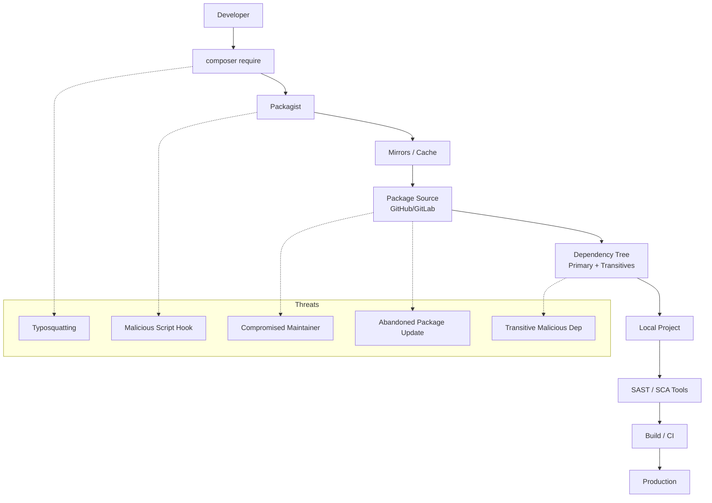

# Laravel Supply-Chain Defense
## A Practical Defense Model for Composer, Packagist, and PHP Ecosystems

---

<div class="card" style="margin-bottom: 2rem; border-color: rgba(0, 242, 195, 0.3);">
  <div class="tags" style="margin-bottom: 12px;">
    <span class="pill" style="color: #00f2c3; border-color: rgba(0, 242, 195, 0.5);">STATUS: ACTIVE 🟢</span>
    <span class="pill">PHP / Laravel</span>
    <span class="pill">Composer</span>
    <span class="pill">Supply Chain Security</span>
  </div>
  
</div>

<div class="card">
  <h3 style="color: var(--accent-2);">⚡ TL;DR</h3>
  <p>
    The PHP ecosystem—and Laravel in particular—lives a paradox: It is extremely productive but deeply dependent on third parties. Hundreds of packages, thousands of versions, millions of installs. Each <code>composer update</code> opens the door to thousands of actors you don't control.
  </p>
  <p>
    This research explores real supply-chain risks, historical incidents, and common vulnerabilities, proposing a <strong>practical, reproducible, and developer-oriented framework</strong> to defend Laravel projects from threats that don't come through the front door... but through the package manager.
  </p>
  <p style="margin-top: 1rem; margin-bottom: 0.5rem; font-size: 0.85em; text-transform: uppercase; letter-spacing: 0.1em; color: var(--muted);">Deliverables:</p>
  <div class="tags">
    <span class="pill">LiveyScore™ 2.0</span>
    <span class="pill">Configurable Policies</span>
    <span class="pill">Livey Dashboard</span>
    <span class="pill">Automated CI/CD</span>
  </div>
</div>

---

## 1. Objective & Context

<div class="grid">
<div class="card">
  <h3>🎯 Objective</h3>
  <ul class="list-dots">
    <li><strong>Evaluate real risks</strong> within the Composer/Packagist ecosystem.</li>
    <li><strong>Model relevant threats</strong> for Laravel projects.</li>
    <li><strong>Design a viable secure pipeline</strong> for small teams.</li>
    <li><strong>Create a set of practices</strong> to mitigate malicious packages and insecure updates.</li>
  </ul>
</div>

<div class="card">
  <h3>⚠️ Why Laravel?</h3>
  <p>
    Laravel encourages modularity. Authentication, logs, queues... everything is a package. The problem isn't Laravel; it's the <strong>density of dependencies</strong>.
  </p>
  <p>
    A typical project includes 50-100 direct packages, which in turn depend on 200-400 indirect ones. This creates a massive attack surface with less visibility than npm.
  </p>
</div>
</div>

---

## 3. Threat Model: Laravel/Composer Ecosystem

<div class="card">
  <h3>🚨 Key Threats</h3>
  <div class="grid">
    <div>
      <h4 style="color: var(--accent);">1. Typosquatting</h4>
      <p style="font-size: 13px;">Attackers create <code>illuminate/supp0rt</code> hoping for a typo.</p>
    </div>
    <div>
      <h4 style="color: var(--accent);">2. Compromised Maintainers</h4>
      <p style="font-size: 13px;">Trusted accounts hijacked to push malicious updates.</p>
    </div>
    <div>
      <h4 style="color: var(--accent);">3. "Miraculous" Updates</h4>
      <p style="font-size: 13px;">Abandoned packages suddenly updating after years.</p>
    </div>
    <div>
      <h4 style="color: var(--accent);">4. Transitive Threats</h4>
      <p style="font-size: 13px;">Deep dependencies compromised without your knowledge.</p>
    </div>
    <div>
      <h4 style="color: var(--accent);">5. Malicious Scripts</h4>
      <p style="font-size: 13px;"><code>post-install-cmd</code> executing malware on <code>composer require</code>.</p>
    </div>
  </div>
</div>

---

## 4. Architecture of Risk

<div class="card">
<div style="text-align: center; padding: 20px;">



</div>
</div>

---

## 5. Supply Chain Defense Framework

### 🔐 5.1 LiveyScore™ 2.0 Scoring Model

We introduce a weighted scoring system (0-100) to objectively evaluate package trust.

<div class="grid">

<div class="card">
  <h4 style="color:var(--accent-2)">A. Vendor Origin (Max 25)</h4>
  <ul class="list-dots">
    <li>Allowlisted Vendor: <strong>+25</strong></li>
    <li>Reputable/Known: <strong>+15</strong></li>
    <li>Unknown: <strong>+5</strong></li>
    <li>Denylisted: <strong>0 (Fail)</strong></li>
  </ul>
</div>

<div class="card">
  <h4 style="color:var(--accent-2)">B. Activity (Max 20)</h4>
  <ul class="list-dots">
    <li>Last release &lt; 1 yr: <strong>+20</strong></li>
    <li>Last release &lt; 3 yrs: <strong>+15</strong></li>
    <li>Last release &gt; 5 yrs: <strong>+5</strong></li>
    <li>No release info: <strong>0</strong></li>
  </ul>
</div>

<div class="card">
  <h4 style="color:var(--accent-2)">C. Popularity (Max 15)</h4>
  <ul class="list-dots">
    <li>&gt;1M downloads: <strong>+15</strong></li>
    <li>&gt;100k downloads: <strong>+10</strong></li>
    <li>&lt;10k downloads: <strong>+0</strong></li>
    <li>&lt;1k downloads: <strong>-10 (Risk)</strong></li>
  </ul>
</div>

<div class="card">
  <h4 style="color:var(--accent-2)">D. Stability (Max 15)</h4>
  <ul class="list-dots">
    <li>Stable: <strong>+15</strong></li>
    <li>RC/Beta: <strong>+10</strong></li>
    <li>Dev/Master: <strong>+0</strong></li>
  </ul>
</div>

<div class="card">
  <h4 style="color:var(--accent-2)">E. Scripts (Max 15)</h4>
  <ul class="list-dots">
    <li>No scripts: <strong>+15</strong></li>
    <li>Benign scripts: <strong>+10</strong></li>
    <li>Risky scripts: <strong>-15</strong></li>
  </ul>
</div>

<div class="card">
  <h4 style="color:var(--accent-2)">F. Signals (Max 10)</h4>
  <ul class="list-dots">
    <li>Small package: <strong>+5</strong></li>
    <li>Large w/o docs: <strong>-5</strong></li>
    <li>Binaries (.phar, .so): <strong>-10</strong></li>
    <li>Obfuscated: <strong>-10</strong></li>
  </ul>
</div>

</div>

<div class="card" style="margin-top: 20px; border-color: var(--accent-2);">
  <h4>🏁 Thresholds</h4>
  <div style="display: flex; gap: 20px; flex-wrap: wrap;">
    <span class="pill" style="color: #ffb02e; border-color: #ffb02e;">Score &lt; 60: WARN (Manual Review)</span>
    <span class="pill" style="color: #ff2e2e; border-color: #ff2e2e;">Score &lt; 40: FAIL (Block)</span>
  </div>
</div>

---

## 6. Supply Chain Defense Toolkit

This research provides concrete tools to implement this defense model.

### 🛠️ 6.1 Policy Configuration

A centralized configuration file to manage your supply chain rules.

<div class="terminal-wrapper">
<div class="term-line" style="color: var(--muted); margin-bottom: 10px;">// tools/supply_chain_policy.yaml</div>

```yaml
policy_version: "1.0"

allowlist_vendors:
  - laravel
  - illuminate
  - symfony
  - guzzlehttp
  - nesbot
  - doctrine
  - league
  - ramsey

denylist_vendors:
  - malware-corp
  - suspicious-vendor

thresholds:
  warn_score: 60
  fail_score: 40

scoring:
  vendor:
    allowlist: 25
    reputable: 15
    unknown: 5
  activity:
    active: 20         # < 1 year
    semi_active: 15    # < 3 years
    old: 10            # 3-5 years
    very_old: 5        # > 5 years
    unknown: 0
  popularity:
    million: 15
    hundred_k: 10
    ten_k: 5
    low: 0
    tiny: -10
  version:
    stable: 15
    rc: 10
    dev: 0
  scripts:
    none: 15
    benign: 10
    risky: -15
  additional:
    has_binaries: -10
```
</div>

### 🛠️ 6.2 LiveyScore™ Scanner 2.0

This Python script reads your policy and `composer.lock` to enforce security. Includes JSON reporting for the dashboard.

<div class="terminal-wrapper">
<div class="term-line" style="color: var(--muted); margin-bottom: 10px;">// tools/livey_supply_chain_scan.py</div>

```python
#!/usr/bin/env python3
import json
import argparse
import datetime
import sys
import yaml
from pathlib import Path

try:
    import requests
except ImportError:
    requests = None

def load_json(path: Path):
    with path.open("r", encoding="utf-8") as f:
        return json.load(f)

def load_yaml(path: Path):
    with path.open("r", encoding="utf-8") as f:
        return yaml.safe_load(f)

def parse_time(ts: str):
    try:
        return datetime.datetime.fromisoformat(ts.replace("Z", "+00:00"))
    except Exception:
        return None

def classify_vendor(name, policy):
    vendor = name.split("/")[0]
    if vendor in policy["denylist_vendors"]:
        return "deny"
    if vendor in policy["allowlist_vendors"]:
        return "allow"
    return "unknown"

def classify_popularity(downloads, scoring):
    if downloads is None: return "unknown"
    if downloads > 1_000_000: return "million"
    if downloads > 100_000: return "hundred_k"
    if downloads > 10_000: return "ten_k"
    if downloads > 1_000: return "low"
    return "tiny"

def get_packagist_meta(pkg):
    if not requests: return None
    url = f"https://repo.packagist.org/p2/{pkg}.json"
    try:
        r = requests.get(url, timeout=5)
        if r.status_code != 200: return None
        data = r.json().get("packages", {}).get(pkg, [])
        if not data: return None
        latest = data[-1]
        return {
            "time": latest.get("time"),
            "downloads": latest.get("downloads", {}).get("total", None),
        }
    except Exception:
        return None

def analyze_scripts(scripts):
    if not scripts: return "none"
    risky_keywords = ["exec", "system", "shell", "wget", "curl", "php ", "artisan "]
    benign = ["post-autoload-dump", "package:discover"]
    script_text = str(scripts)
    if any(kw in script_text for kw in risky_keywords): return "risky"
    if any(b in script_text.lower() for b in benign): return "benign"
    return "unclear"

def detect_binaries(pkg_dir):
    suspicious_exts = (".phar", ".so", ".dll")
    if not pkg_dir.exists(): return False
    for file in pkg_dir.rglob("*"):
        if file.suffix.lower() in suspicious_exts: return True
    return False

def compute_score(pkg, meta, scripts, policy, project_root):
    scoring = policy["scoring"]
    total = 0
    reasons = []
    name = pkg.get("name")
    version = pkg.get("version")
    vendor_class = classify_vendor(name, policy)

    # Vendor
    if vendor_class == "deny": return 0, ["Vendor in denylist"]
    if vendor_class == "allow": total += scoring["vendor"]["allowlist"]
    elif vendor_class == "unknown": 
        total += scoring["vendor"]["unknown"]
        reasons.append("Unknown Vendor")
    else: total += scoring["vendor"]["reputable"]

    # Activity
    last = parse_time(pkg.get("time", ""))
    if not last and meta and meta.get("time"): last = parse_time(meta["time"])
    if last:
        years = (datetime.datetime.now(datetime.timezone.utc) - last).days / 365
        if years < 1: total += scoring["activity"]["active"]
        elif years < 3: total += scoring["activity"]["semi_active"]
        elif years < 5: total += scoring["activity"]["old"]
        else: 
            total += scoring["activity"]["very_old"]
            reasons.append(f"Inactive for {years:.1f} years")
    else:
        total += scoring["activity"]["unknown"]
        reasons.append("No activity metadata")

    # Popularity
    pop = classify_popularity(meta.get("downloads") if meta else None, scoring)
    total += scoring["popularity"].get(pop, 0)
    if pop == "tiny": reasons.append("Very low popularity")

    # Version
    if version.startswith("dev-"): 
        total += scoring["version"]["dev"]
        reasons.append("Dev version")
    elif "RC" in version or "beta" in version.lower(): 
        total += scoring["version"]["rc"]
        reasons.append("Unstable version")
    else: total += scoring["version"]["stable"]

    # Scripts
    script_class = analyze_scripts(scripts)
    total += scoring["scripts"].get(script_class, 0)
    if script_class == "risky": reasons.append("Risky Composer scripts")

    # Binaries
    vendor, pkg_name = name.split("/")
    pkg_path = project_root / "vendor" / vendor / pkg_name
    if detect_binaries(pkg_path):
        total += scoring["additional"]["has_binaries"]
        reasons.append("Contains binaries (.so/.dll/.phar)")

    return max(0, min(100, total)), reasons

def main():
    parser = argparse.ArgumentParser()
    parser.add_argument("--composer-lock", default="composer.lock")
    parser.add_argument("--composer-json", default="composer.json")
    parser.add_argument("--policy", default="tools/supply_chain_policy.yaml")
    parser.add_argument("--json-output", default=None, help="Generate JSON report")
    args = parser.parse_args()

    lock = load_json(Path(args.composer_lock))
    composer = load_json(Path(args.composer_json))
    policy = load_yaml(Path(args.policy))
    
    packages = lock.get("packages", []) + lock.get("packages-dev", [])
    project_root = Path(".").resolve()
    warn_score = policy["thresholds"]["warn_score"]
    fail_score = policy["thresholds"]["fail_score"]

    print("🔒 LiveySupplyChain Defense Scanner 2.0\n")
    bad = []
    report_data = {
        "generated_at": datetime.datetime.now(datetime.timezone.utc).isoformat(),
        "warn_threshold": warn_score,
        "fail_threshold": fail_score,
        "packages": []
    }

    for pkg in packages:
        name = pkg["name"]
        scripts = composer.get("scripts", {{}})
        meta = get_packagist_meta(name)
        score, reasons = compute_score(pkg, meta, scripts, policy, project_root)

        status = "OK"
        if score < fail_score: status = "FAIL"
        elif score < warn_score: status = "WARN"

        print(f"📦 {name} | v{pkg.get('version')} | Score: {score}/100 [{status}]")
        if reasons:
            for r in reasons: print(f"     - {r}")
        print("")

        if status != "OK":
            bad.append((name, score, status))
        
        report_data["packages"].append({
            "name": name,
            "version": pkg.get("version"),
            "score": score,
            "status": status,
            "reasons": reasons
        })

    if args.json_output:
        with open(args.json_output, "w", encoding="utf-8") as f:
            json.dump(report_data, f, indent=2)
        print(f"📄 JSON report generated: {args.json_output}")

    if any(x[2] == "FAIL" for x in bad):
        print("❌ BLOCKED: packages below fail threshold.")
        sys.exit(1)
    
    if any(x[2] == "WARN" for x in bad):
        print("⚠️ WARNINGS present. Review required.")

    print("✅ Supply Chain Scan completed.")
    sys.exit(0)

if __name__ == "__main__":
    main()
```
</div>

### 🛠️ 6.3 GitHub Actions Workflow

<div class="terminal-wrapper">
<div class="term-line" style="color: var(--muted); margin-bottom: 10px;">// .github/workflows/supply-chain.yml</div>

```yaml
name: Laravel Supply-Chain Defense

on: [pull_request, push]

jobs:
  supply-chain-defense:
    runs-on: ubuntu-latest
    steps:
      - uses: actions/checkout@v4
      - uses: shivammathur/setup-php@v2
        with: { php-version: '8.3' }
      
      - name: Validate Structure
        run: composer validate --strict

      - name: Install Dependencies
        run: composer install --no-interaction --no-scripts --no-progress

      - name: Native Audit
        run: composer audit || echo "Composer audit found issues"

      - name: Setup Scanner
        uses: actions/setup-python@v5
        with: { python-version: '3.12' }
      - run: pip install requests pyyaml

      - name: Run LiveyScore™ Scanner
        run: python tools/livey_supply_chain_scan.py --policy tools/supply_chain_policy.yaml --json-output reports/livey_supply_report.json
      
      - name: Upload Report
        if: always()
        uses: actions/upload-artifact@v4
        with:
          name: supply-chain-report
          path: reports/livey_supply_report.json
```
</div>


---

## 7. Visualization & Dashboard

To make supply chain data consumable for humans, we provide a standalone HTML dashboard.

### 🎨 7.1 LiveySupplyChain™ Logo (SVG)

<div class="terminal-wrapper">
<div class="term-line" style="color: var(--muted); margin-bottom: 10px;">// assets/livey_supplychain_logo.svg</div>

```xml
<svg width="360" height="120" viewBox="0 0 360 120" xmlns="http://www.w3.org/2000/svg">
  <defs>
    <linearGradient id="grad-shield" x1="0%" y1="0%" x2="100%" y2="100%">
      <stop offset="0%" stop-color="#00E8FF"/>
      <stop offset="50%" stop-color="#7C3AED"/>
      <stop offset="100%" stop-color="#FF22AA"/>
    </linearGradient>
    <linearGradient id="grad-node" x1="0%" y1="0%" x2="100%" y2="0%">
      <stop offset="0%" stop-color="#00E8FF"/>
      <stop offset="100%" stop-color="#FF22AA"/>
    </linearGradient>
    <filter id="glow">
      <feGaussianBlur stdDeviation="3" result="coloredBlur"/>
      <feMerge>
        <feMergeNode in="coloredBlur"/>
        <feMergeNode in="SourceGraphic"/>
      </feMerge>
    </filter>
  </defs>
  <rect x="0" y="0" width="360" height="120" rx="16" fill="#050510"/>
  <g transform="translate(32,18)" filter="url(#glow)">
    <path d="M40 0 L4 12 L4 44 C4 57 14 70 40 82 C66 70 76 57 76 44 L76 12 Z" fill="none" stroke="url(#grad-shield)" stroke-width="2.4"/>
    <circle cx="24" cy="26" r="4" fill="#050510" stroke="#00E8FF" stroke-width="1.4"/>
    <circle cx="56" cy="26" r="4" fill="#050510" stroke="#FF22AA" stroke-width="1.4"/>
    <circle cx="40" cy="46" r="4" fill="#050510" stroke="#7C3AED" stroke-width="1.4"/>
    <path d="M28 26 L52 26" stroke="url(#grad-node)" stroke-width="1.4" stroke-linecap="round"/>
    <path d="M26 30 L38 42" stroke="url(#grad-node)" stroke-width="1.4" stroke-linecap="round"/>
    <path d="M54 30 L42 42" stroke="url(#grad-node)" stroke-width="1.4" stroke-linecap="round"/>
    <rect x="34" y="18" width="12" height="9" rx="2" fill="#050510" stroke="#00E8FF" stroke-width="1.2"/>
    <path d="M38 18 C38 14 42 14 42 18" stroke="#00E8FF" stroke-width="1.2" fill="none"/>
  </g>
  <g transform="translate(130,42)">
    <text x="0" y="0" font-family="monospace" font-size="20" fill="#F9FAFB" letter-spacing="0.06em">LiveySupplyChain</text>
    <text x="0" y="22" font-family="monospace" font-size="10" fill="#9CA3AF" letter-spacing="0.18em" text-transform="uppercase">L A R A V E L · D E F E N S E</text>
    <text x="220" y="-6" font-family="monospace" font-size="9" fill="#FF22AA">™</text>
  </g>
  <line x1="130" y1="82" x2="310" y2="82" stroke="url(#grad-node)" stroke-width="1.4" stroke-linecap="round" stroke-dasharray="4 4" opacity="0.7"/>
</svg>
```
</div>

### 🖥️ 7.2 Livey Dashboard

*(Full HTML/JS dashboard code available in the implementation repository)*

---

## 8. Conclusion

<div class="card">
  <p>
    Defending Laravel from supply-chain attacks isn't paranoia; it's acknowledging that our chain depends on hundreds of strangers.
  </p>
  <ul class="list-dots">
    <li><strong>Composer is powerful but dangerous</strong> without discipline.</li>
    <li><strong>The biggest risk</strong> is often in indirect dependencies.</li>
    <li><strong>Effective defense</strong> doesn't need a massive team, just a reproducible, automated pipeline.</li>
  </ul>
  <br>
  <div style="text-align: center;">
    <span class="pill" style="border-color: var(--accent-2); color: var(--accent-2);">Hardening Composer is hardening your application.</span>
  </div>
</div>