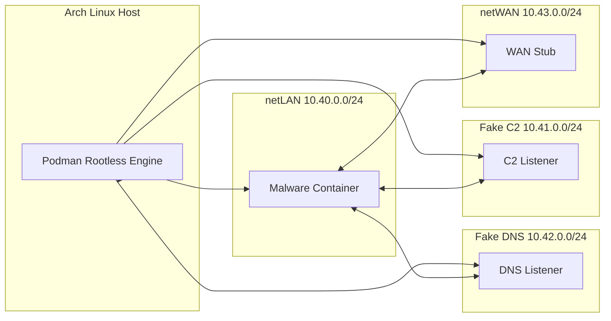

# Multi-Network Cyberdecks
## Simulated C2 for Secure Malware Execution Using Rootless Containers

---

> **PROJECT STATUS:** `ACTIVE` 🟢
> **HOST:** Arch Linux · **ENGINE:** Podman (Rootless)
> **FOCUS:** C2 Simulation · Network Isolation · Malware Execution
>  

### ⚡ TL;DR

Dynamic malware analysis often relies on observing how a sample attempts to communicate with its **Command & Control (C2)** server.
**The Problem:** You cannot allow malware to contact the real Internet. The risk is too high, even within a VM.
**The Solution:** Build a **simulated C2** in a completely isolated environment using multiple segmented networks and rootless containers.
This allows us to study—with scientific precision—beaconing patterns, exfiltration attempts, and protocols, all within a hermetic environment where **Internet is fiction** and you are the architect of the universe.

---

## 1. Research Objective

Establish a **reproducible pipeline** for executing malware within an ecosystem of fake networks, where each network fulfills a specific role, allowing us to study how the sample:

*   Resolves DNS.
*   Discovers gateways.
*   Attempts to reach its C2.
*   Interprets errors.
*   Negotiates fake tunnels.
*   Modifies its beaconing cycle based on topology.

Additionally, we measure:

*   Generated traffic.
*   Periodicity.
*   Custom HTTP headers.
*   TLS/handshake usage.
*   Encoded payloads.

This research produces a useful baseline for future analysis and allows for prototyping defenses or detections.

---

## 2. "Cyberdeck" Architecture: Your Multiverse of Networks

We define 4 distinct networks:

*   **netLAN (10.40.0.0/24):** Simulated corporate network; the malware lives here.
*   **netC2 (10.41.0.0/24):** Network hosting the fake C2 listener.
*   **netDNS (10.42.0.0/24):** Controlled DNS server (responds with whatever we want).
*   **netWAN (10.43.0.0/24):** Simulates the Internet, but is isolated; no egress.

These networks are not connected to any physical interface. No external traffic exists.
Everything happening within the lab is purely locally contained.

### Architectural Diagram (Mermaid)



---

## 3. Lab Preparation on Arch Linux

### 3.1 Create Internal Networks

```bash
podman network create netLAN --internal --subnet 10.40.0.0/24
podman network create netC2  --internal --subnet 10.41.0.0/24
podman network create netDNS --internal --subnet 10.42.0.0/24
podman network create netWAN --internal --subnet 10.43.0.0/24
```
> 💡 **Note:** These networks have no real Internet access. The malware will live deceived within a mathematical universe contained in namespaces.

---

## 4. Simulating Core Services (DNS + C2)

### 4.1 Fake DNS

This DNS does not resolve real names. You decide what it responds with.

```bash
podman run -d --rm --network netDNS \
  --name fake-dns alpine \
  sh -c "apk add --no-cache bind-tools && nc -lk -p 53"
```

### 4.2 Fake C2 (HTTP or Generic TCP)

```bash
podman run -d --rm --network netC2 \
  --name c2-listener alpine \
  sh -c "nc -lk -p 80"
```
Every beacon the malware attempts to send will be captured here.

---

## 5. The Malware Lives in `netLAN`

Rootless containers allow executing dangerous binaries without real permissions on the host.

### 5.1 Execute Sample Inside Container

```bash
podman run --rm -it \
  --network netLAN \
  -v ~/samples:/mal:ro \
  alpine sh -c "
  echo '[+] Running sample in isolated LAN...';
  chmod +x /mal/sample.bin || true;
  /mal/sample.bin;
  "
```

### 5.2 Simultaneous Traffic Capture

On the host:

```bash
sudo tcpdump -i any net 10.40.0.0/16 -w c2-capture.pcap &
TCP_PID=$!
```

Kill the capture later with:

```bash
kill $TCP_PID
```

---

## 6. Forcing Fake Routes, "Failures", and Evasive Behavior

A valuable behavior to study is how the malware adapts when:

*   DNS responds `NXDOMAIN`.
*   DNS always resolves to the same IP.
*   The C2 responds with weird banners.
*   The C2 does not respond.
*   There is artificial latency.
*   There is a total network outage.

### 🧪 Case 6.1: DNS Always Resolves Suspicious Domain to Fake IP

```bash
echo "evil.com 10.41.0.10" >> dns-map.txt
```

**Modified Fake DNS Server:**

```bash
podman run -d --rm --network netDNS \
  --name fake-dns \
  bash -c "
    while true; do
      read q; echo \"$q resolved to 10.41.0.10\"; 
    done | nc -lk -p 53
  "
```

### 🧪 Case 6.2: Introduce Artificial Latency

```bash
tc qdisc add dev <veth-interface> root netem delay 180ms
```
This simulates a slow or saturated remote C2.

### 🧪 Case 6.3: C2 Responds with Incorrect Banner

```bash
podman run -d --rm --network netC2 --name fake-c2 \
  sh -c "while true; do echo 'HTTP/1.1 502 Bad Gateway'; sleep 1; done | nc -lk -p 80"
```
Many malware strains interpret HTTP errors as triggers for fallback mechanisms or alternative exfiltration methods.

---

## 7. Beacon Capture and Interpretation

### 7.1 C2 Logs

```bash
podman logs c2-listener > c2-traffic.log
```

**Example Output:**
```http
POST /gate/resource?id=1001 HTTP/1.1
User-Agent: Microsoft Stage/1.0
Host: evil.com
Content-Length: 48
<binary beacon payload>
```

### 7.2 PCAP Analysis

```bash
tshark -r c2-capture.pcap -T fields -e ip.src -e http.host -e data
```

Here we look for patterns:
*   Exact beacon periodicity (e.g., every 5s, 20s, 60s).
*   Changes when DNS responds incorrectly.
*   Payload size.
*   Whether the malware retransmits when there is no ACK.
*   Usage of PUT, GET, POST commands or custom protocols.

---

## 8. Building the Malware Behavior Baseline

A baseline includes:

*   SHA256 Hash of the sample.
*   First observed beacon (URL, headers, tempo).
*   DNS Fallback behavior.
*   Typical binary payload.
*   Conditions under which beaconing stops.
*   Maximum time between retransmissions.
*   Frequency under induced latency.

**Baseline Example:**

```markdown
### Baseline: sample_A

- **Hash:** `3a9ec3fce9...`
- **Beacon URL:** `/gate/resource`
- **Beacon Period:** ±7s
- **DNS Fallback:** Fixed resolve to 10.41.0.10
- **Payload Average Size:** 48–60 bytes
- **Reaction to 502 TCP Banner:** Stops after 4 attempts
- **Reaction to NXDOMAIN:** Retries indefinitely
```
This baseline functions as **observable truth** for future comparisons.

---

## 9. Proposed Experiments

1.  **Compare Two Similar Samples:** Which one maintains beaconing in the face of artificial adversity?
2.  **Fake C2 as Honeypot:** Adjust fake banners to provoke alternative routes.
3.  **Common Pattern Detection:** Many malware strains use constant beacon intervals (5s, 10s, 60s).
4.  **Payload Entropy Analysis:** High entropy payload → encrypted → detect simulated key exchange.
5.  **Create a "C2-Profiles" Dataset:** Useful for automatic classification.

---

## 10. Conclusion

This research demonstrates that:

*   You don't need a monstrous VM to study C2 behavior.
*   Rootless containers achieve detailed, validatable sandboxing.
*   Fake networks allow us to see how the sample reacts when the world fails.
*   The analyst obtains an **observable profile**, not just a guess.
*   Samples can be reproduced and compared without real risk.

With this, you can now produce:
*   Family baselines.
*   Beaconing datasets.
*   Evasion evaluations.
*   Comparative analysis between samples.

**Multi-Network Cyberdecks** turn your machine into a hand-stitched laboratory where malware behaves as it believes it should, but within your simulated universe, defined by rules you write.